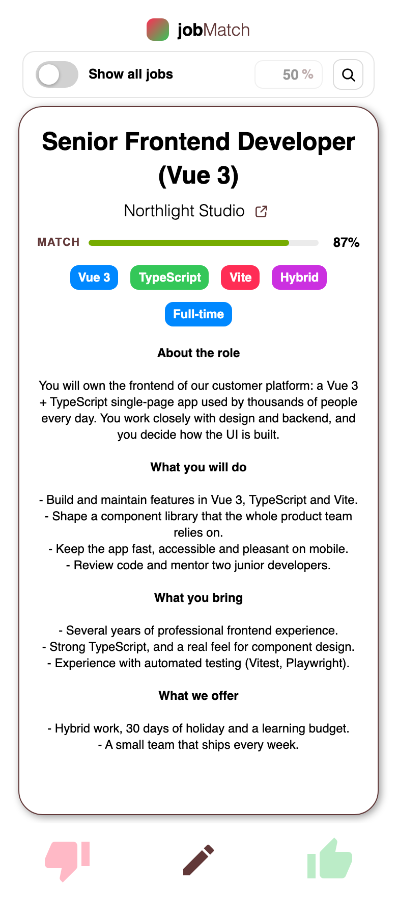
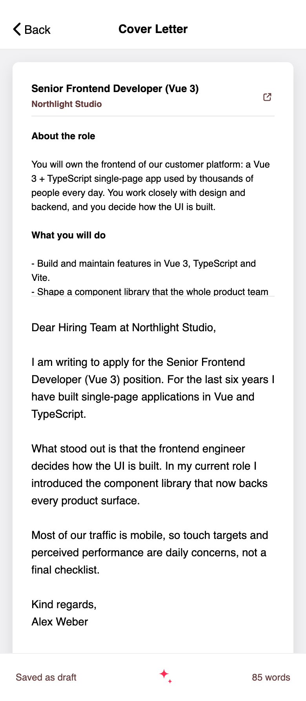

# jobMatch

jobMatch is a mobile-first job hunting app. It streams freshly scraped LinkedIn
job ads into a swipe deck, ranks each one by cosine similarity between the ad
and your search keywords, and turns a job you liked into a downloadable
application — an AI-drafted cover letter you can edit, plus your CV, merged
into a single PDF.

The app itself is a Vue 3 + TypeScript frontend. All the heavy lifting —
scraping, embedding, matching, cover letter generation, PDF assembly — happens
in [jobMatchServer](https://github.com/freshmozart1/jobMatchServer), which has
to be running for jobMatch to do anything. See
[Backend — required](#backend--required).

## Screenshots

| Match page                                                                                                                                         | Cover letter editor                                                                                                                                                                                |
| -------------------------------------------------------------------------------------------------------------------------------------------------- | -------------------------------------------------------------------------------------------------------------------------------------------------------------------------------------------------- |
|  |  |

## Features

- **Swipe deck** — jobs arrive as a stack of cards you swipe right to like or
  left to dislike, with the next card previewed underneath
  (`src/components/jobCard/JobCardStack.vue`). Each card shows the title,
  company (linking back to the original ad), tags and the full description.
- **Search** — up to five keywords plus a city, a search radius in kilometres
  and a "date posted" window (past 24 hours / week / month)
  (`src/pages/match/SearchPage.vue`). Everything is persisted in `localStorage`,
  so your search survives a reload, and changing it re-runs the scrape.
- **Match score** — every card carries a cosine-similarity meter comparing the
  ad to your keywords
  (`src/components/jobCard/JobCardCosineSimilarity.vue`). A filter bar lets you
  hide everything below an adjustable threshold
  (`src/components/MatchFilterBar.vue`).
- **Application editor** — every card opens an editor
  (`src/pages/match/ApplicationEditorPage.vue`) with the job it belongs to kept
  in view. Generate a cover letter tailored to that job with one tap, then edit
  it by hand — drafts auto-save to `localStorage` and upload to the server
  (`src/components/coverLetter/CoverLetterEditor.vue`). The same editor's menu
  lets you attach your CV as a PDF, and download the cover letter, the CV, or
  both merged into a single application PDF
  (`src/components/application/ApplicationEditorMenu.vue`).

## Requirements

- Node.js `^20.19.0 || >=22.12.0`
- npm
- A running [jobMatchServer](https://github.com/freshmozart1/jobMatchServer)
  instance — see below

## Backend — required

**jobMatch is a frontend only. Without a running jobMatchServer it renders, but
nothing works.** Job scraping, embeddings and match scoring, cover letter
generation, CV storage and PDF assembly all live in the server. With no backend
reachable, the deck stays empty and the application editor cannot save or
download anything.

The frontend resolves the server's base URL in `src/lib/api.ts`:

```ts
const API_BASE_URL =
    import.meta.env.VITE_JOB_MATCH_SERVER_URL ??
    `http://${window.location.hostname}:3000`;
```

- `VITE_JOB_MATCH_SERVER_URL` — the origin (and optional path prefix) of your
  jobMatchServer, e.g. `http://localhost:3000`. Like every `VITE_*` variable it
  is inlined by Vite **at build time**, not read at runtime, so changing it
  requires restarting `npm run dev` or rebuilding.
- When it is unset, the base URL falls back to
  `http://<current hostname>:3000` — the hostname the frontend itself is served
  from, on port `3000`. That default only works when jobMatchServer runs on
  port 3000 of the same host. If the server lives anywhere else, set the
  variable.

Put it in a `.env.local` (git-ignored via `*.local`) at the repo root:

```sh
VITE_JOB_MATCH_SERVER_URL=http://localhost:3000
```

### Order of operations

1. Start [jobMatchServer](https://github.com/freshmozart1/jobMatchServer) and
   note the URL it listens on.
2. Install the frontend's dependencies:

    ```sh
    npm install
    ```

3. If the server is not on port 3000 of the frontend's own hostname, create
   `.env.local` as shown above.
4. Start the frontend:

    ```sh
    npm run dev
    ```

    It serves on `http://0.0.0.0:5173`, so the app is also reachable from a
    phone on the same network — which is how it is meant to be used.

## Commands

| Command              | What it does                                                        |
| -------------------- | ------------------------------------------------------------------- |
| `npm run dev`        | Vite dev server with hot reload on `http://0.0.0.0:5173`            |
| `npm run build`      | Production build into `dist/`                                       |
| `npm run preview`    | Serves the built `dist/` locally on `http://localhost:4173`         |
| `npm run type-check` | Type-checks the project with `vue-tsc --build`                      |
| `npm run lint`       | Runs ESLint over the repo with `--fix`                              |
| `npm run format`     | Formats `src/` with Prettier                                        |
| `npm run test:unit`  | Vitest unit tests (watch mode; append `-- --run` for a single pass) |
| `npm run test:e2e`   | Playwright end-to-end tests                                         |

## Testing

Unit tests live in `src/__tests__/` and run under Vitest with jsdom:

```sh
npm run test:unit -- --run
```

End-to-end tests live in `e2e/` and run under Playwright. Install the browsers
once before the first run:

```sh
npx playwright install
```

```sh
npm run test:e2e

# Only Chromium
npm run test:e2e -- --project=chromium

# Step through a run in the Playwright inspector
npm run test:e2e -- --debug
```

Playwright starts the server for you (`npm run dev` locally, `npm run preview`
on CI) and reuses one that is already running. The base URL is
`http://localhost:5173` locally and `http://localhost:4173` on CI. The e2e
specs drive the real app, so they expect a jobMatchServer at
`http://localhost:3000`.

## Project layout

```
src/
├── pages/          Route-level views (match deck, search, application editor)
├── components/     Job cards, brand bar, match filter, cover letter and CV UI
├── lib/            API client (base URL resolution, JSON/SSE/blob helpers)
├── constants/      CSS custom properties for colors, layout and typography
├── router/         vue-router setup
├── mockups/        Sample scrape payload used while developing
└── __tests__/      Vitest unit tests
```

### Path aliases

Resolved by Vite (`vite.config.ts`); `@/*` and `@pages` are additionally
mapped in `tsconfig.app.json` for the type checker:

| Alias         | Resolves to          |
| ------------- | -------------------- |
| `@/*`         | `src/*`              |
| `@pages`      | `src/pages/index.ts` |
| `@components` | `src/components`     |
| `@assets`     | `src/assets`         |

## Further reading

- [Vue (Official) VS Code extension](https://marketplace.visualstudio.com/items?itemName=Vue.volar)
  — required for `.vue` type support in the editor (disable Vetur)
- [`vue-tsc`](https://github.com/vuejs/language-tools) — the type checker that
  replaces `tsc` so `.vue` imports are understood
- [Vite configuration reference](https://vite.dev/config/)
- [Vue.js devtools](https://devtools.vuejs.org/) — also available in-app during
  `npm run dev` via `vite-plugin-vue-devtools`
